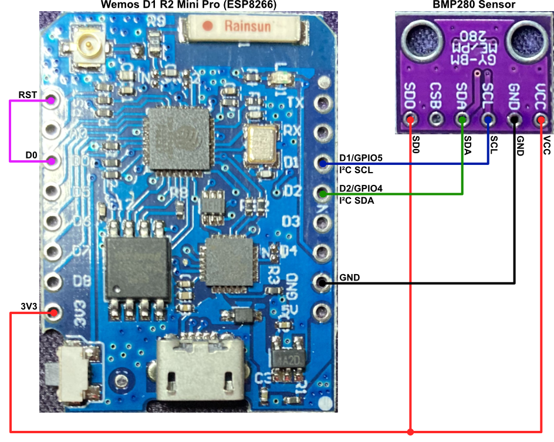

# ESP8266 with BMP280

## Background

Many examples of ESP8266 and ESP32 sketches that you will find on GitHub and elsewhere on the web have a basic structure which looks something like this:

1. `setup()`:

	- start WiFi services
	- connect to the MQTT broker

2. `loop()`:

	- give WiFi and MQTT services guaranteed CPU time
	- at some predetermined interval:

		- read the sensor
		- package the reading into an MQTT payload and transmit

Although this *works*, it is quite *fragile.* In particular, if WiFi suffers a transient outage, or if the MQTT TCP connection is broken, the sensor will generally either freeze or just continue in blissful ignorance of the fact that the rug has been pulled out from under it. The first you will know about such problems is when data goes missing from your graphs.

When I am asked about this problem on the [IOTstack Discord channel](https://discord.gg/ZpKHnks), I generally recommend a sketch structure which avoids using `setup()` and, instead, is mostly driven from `loop()`:

1. `setup()`

2. `loop()`:

	- start WiFi services and keep them running, restarting as and when required
	
	- at some predetermined interval:
	
		- read the sensor
		- package the reading into an MQTT payload and add it to a queue
	
	- if the queue is non-empty:
	
		- connect to the MQTT broker
		- transmit all the queued messages
		- disconnect from the MQTT broker

This strategy is far more robust. Although I generally include timed self-reboots in my sketches (eg every 30 days) there is no reason why a sketch written in this manner should not run indefinitely and be completely reliable.

The approach of only maintaining a TCP session for as long as is required to transmit all the available data is in keeping with best practice. Holding a TCP session open while there is no data to transmit consumes resources at both ends and is to be discouraged.

> If you don't believe me, think about how web pages are served. It's a whole series of discrete TCP connections. One connection to fetch the HTML. Another to fetch the CSS. Separate connections for each distinct graphic element. And so on. All those connections are open-fetch-close. This approach is not unusual. In fact, it is the many examples of IoT devices keeping MQTT connections open when there is no data to send that are *unusual.*

## Practical example

Recently (September 2024) I was asked to provide a practical example for others to study and adapt to their own needs. This repository is that example. It is based on an ESP8266 (specifically a Wemos D1 R2 Mini Pro) plus a BMP280 temperature and atmospheric pressure sensor. The sketch should work for any ESP8266-based board but, because of their different communications requirements, it will not work on ESP32-based boards without modification.

| <a name="figure1"></a>Figure 1 — Wiring Diagram |
|:-----------------------------------------------:|
|           |

## Dependencies

If you have not already done so, you will need to add the following libraries to your IDE:

- `<AsyncDelay.h>` [AsyncDelay by Steve Marple](https://github.com/stevemarple/AsyncDelay)
- `<MQTT.h>` [MQTT by Joel Gaehwhiler](https://github.com/256dpi/arduino-mqtt)
- `<cppQueue.h>` [Queue by SMFSW](https://github.com/SMFSW/Queue)
- `<Adafruit_Sensor.h>` [Adafruit Unified Sensor by Adafruit](https://github.com/adafruit/Adafruit_Sensor)
- `<Adafruit_BMP280.h>` [Adafruit BMP280 Library by Adafruit](https://github.com/adafruit/Adafruit_BMP280_Library)

### built-in libraries

These libraries are mentioned in `Defines.h` but they are built into the Arduino IDE and don't need to be installed separately:

- `<Arduino.h>`
- `<ESP8266WiFi.h>`
- `<ArduinoOTA.h>`
- `<Wire.h>`

## Sketch configuration

Before you compile the sketch, you should edit `Defines.h` and set values for the following variables:

- `WIFI_SSID` should be set to the name of your WiFi network.
- `WIFI_PSK` should be set to the join password for your WiFi network.
- <a name="dhcpClientID"></a>`WIFI_DHCP_ClientID` is the name your sensor uses to identify itself on your network. You need to follow DNS rules for this name (prefer lower-case letters, digits and the hyphen - do not use underscores or other special characters).
- `MQTTHostFQDN_or_IP` the fully-qualified domain name (FQDN), or multicast domain name service (mDNS) name, or IP address of the host where your Mosquitto broker is running. Examples:

	* IP address : `192.168.1.100`
	* mDNS name : `iot-hub.local`
	* FQDN : `iot-hub.my.domain.com`

- <a name="topicPrefix"></a>`MQTTTopicPrefix` is the first element in topic strings. Defaults to "home".
- `LocalHeightAboveSeaLevelInMetres` this is used to estimate barometric pressure at sea-level using local barometric pressure and current temperature as inputs.
- `OTA_Host_Password` optional. Defaults to a null string. Only set a non-null value if you want to protect the board during Over-the-Air (OTA) operations.

Derived values:

- `OTA_Host_Name` defaults to the value you set for [`WIFI_DHCP_ClientID`](#dhcpClientID). This is the name you will see in the Arduino IDE for OTA operations. You can set a different name if you wish but you should respect the rules for DNS names because this the value you set here is used to construct the board's mDNS name.
- <a name="mqttClientID"></a>`MQTTClientID` also defaults to the value you set for [`WIFI_DHCP_ClientID`](#dhcpClientID). This string appears in the second field of MQTT topic strings.

## MQTT topics

The sketch transmits telemetry against three topics:

* `home/sketch/bmp280/temperature`. Example payload:

	``` json
	{
		"temp_C":22.3,
		"temp_F":72.1
	}
	```

* `home/sketch/bmp280/pressure`. Example payload:

	``` json
	{
		"local_hPa":973.16,
		"sea_hPa":1011.82,
		"trend":"falling"
	}
	```

* `home/sketch/status`. Example payload:

	``` json
	{
		"ssid":"«WIFI_SSID»",
		"mac":"DE:AD:BE:EF:01:23",
		"ip":"192.168.132.207",
		"heap":39064,
		"upTime":77105
	}
	```

In the topic strings:

* `home` is taken from [`MQTTTopicPrefix`](#topicPrefix).
* `sketch` is taken from [`MQTTClientID`](#mqttClientID) which defaults to the value of [`WIFI_DHCP_ClientID`](#dhcpClientID).
* `bmp280`, `temperature` and `pressure` are defined in `Sensor.h`.
* `status` is defined in `Status.h`.

## Operation

### status

The sketch reports "status" every five minutes. The values reported are really only of interest if you are investigating a problem. The SSID will tell you which WIFi network the ESP8266 has joined, and the MAC address of the ESP8266's WiFi adapter will help you identify it in ARP tables.

The IP address lets you ping the device and can also be useful to confirm that the correct IP address is being associated with the board's mDNS name (set in `OTA_Host_Name`) when you open the <kbd>Tools</kbd>&nbsp;»&nbsp;<kbd>Port</kbd> menu in the Arduino IDE. Rebooting the board is likely to cause it to acquire a different IP address and, sometimes, the mDNS name takes a while to catch up.

The heap value can be a useful indicator of memory leaks (eg if the value keeps growing over time). The uptime value is the number of seconds since the last reboot and is a good guide to overall sketch health.

### metrics

The sketch reports temperature and pressure every 10 minutes. Please don't be *too* hasty about choosing a different value. It is perfectly OK to report temperature more frequently but you will reduce the utility of the pressure trend analysis if you use a shorter time.

Think of the pressure trend analysis as akin to tapping on the glass of a barometer and setting the marker needle to the current position. Sure, you can come back in five minutes and do it again but it probably won't tell you much about the trend because the interval is too short. Leaving an hour between taps on the glass is going to get you a better indication of whether pressure is rising, falling or remaining steady.

The same applies to the logic employed by the analysis algorithm. In effect, it's trying to plot a straight line of best fit through the observations taken at equally-spaced time intervals over the last hour, and then running an hypothesis test to decide whether it is fair to conclude that the line of best fit has a positive slope, a negative slope, or unable to decide.

## Logging

`Defines.h` declares:

``` cpp
#define SerialDebugging true
```

The sketch includes copious debugging statements which will fill your serial console with more information than you are likely to need.

That will all be turned off if you set `SerialDebugging` to `false` and recompile. The resulting sketch binary will be a bit smaller.

Whenever the sketch detects a problem it is unable to cure by retrying, it calls `fatalError()` (defined in `Errors.h`). That routine displays both an error code and the name of the function that invoked `fatalError()`.

If `SerialDebugging` is `false` when `fatalError()` is called, the serial port is re-enabled so that final error message can be displayed.

`fatalError()` also blinks the on-board LED rapidly to indicate an error condition. In other words, if you have compiled the sketch without the debugging code enabled and you notice the LED blinking rapidly indicating that the board is in a restart loop, you should be able to connect to the serial port and at least have a starting point for further investigation.

## See also

If you are just getting started with Internet of Things (IoT) you may find these resources useful:

1. [PiBuilder](https://github.com/Paraphraser/PiBuilder) will help you construct a robust platform for IoT services. Works on both Raspberry Pi and Debian (both native installations and as [Proxmox-ve guests](https://github.com/Paraphraser/PiBuilder/blob/master/docs/running-on-proxmox-debian.md)). Installs IOTstack.

2. [SensorsIot/IOTstack](https://github.com/SensorsIot/IOTstack) is a framework for marshalling arbitrary collections of containers using `docker-compose`. The canonical example is the "MING stack":

	* Mosquitto
	* InfluxDB
	* Node-RED
	* Grafana

	IOTstack supports numerous containers. See [the IOTstack Wiki](https://sensorsiot.github.io/IOTstack/).
	
	Note that if you use PiBuilder to construct your system, you get IOTstack installed "for free". You do not need to do any separate installations.

3. The [Three-Node Flow](https://gist.github.com/Paraphraser/c9db25d131dd4c09848ffb353b69038f): an efficient recipe for getting MQTT data into an InfluxDB database using Node-Red.

Pulling all of this together:

1. You use PiBuilder to construct your IoT server platform.
2. You use the IOTstack menu to create an initial "stack" with the MING components.
3. You use this repo to program an ESP8266 plus a BMP280 sensor.
4. You follow the Three-Node Flow guidance to get your sensor data into an InfluxDB database.
5. You use Grafana to build a dashboard to visualise your BMP280 temperature and pressure data. This step is where you will need to do a bit of Googling.
